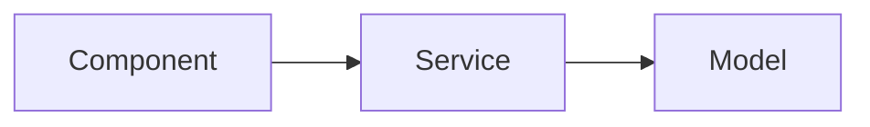
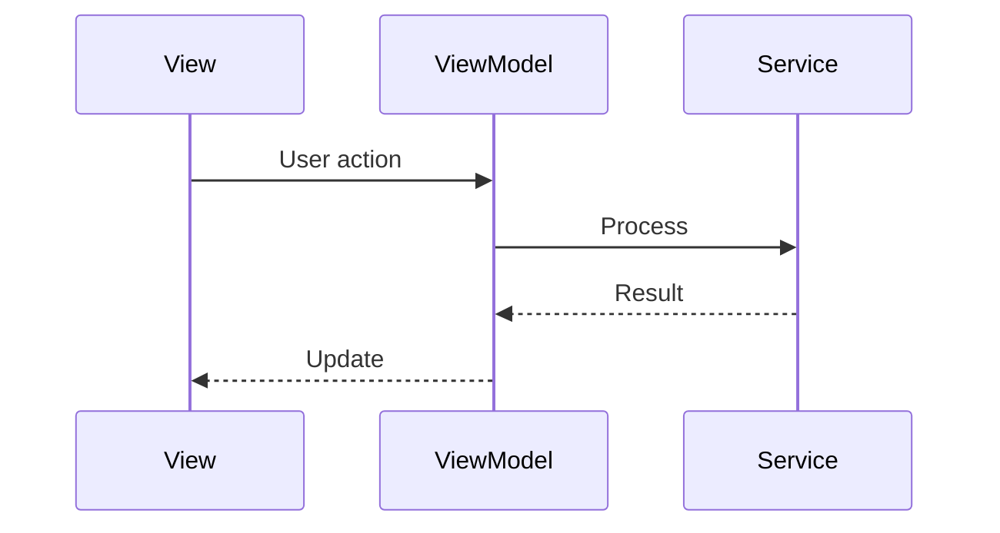
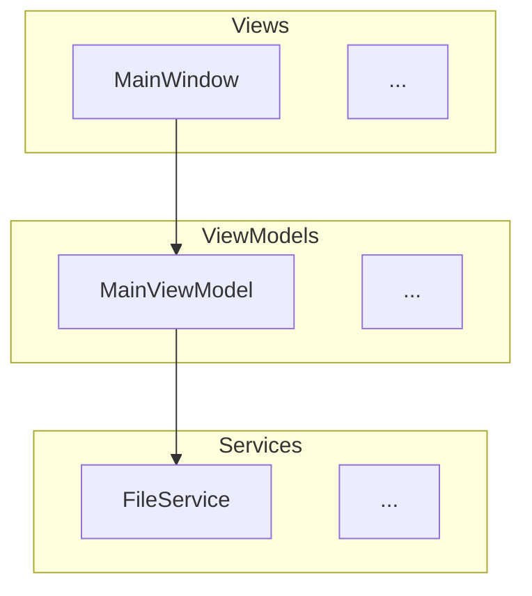
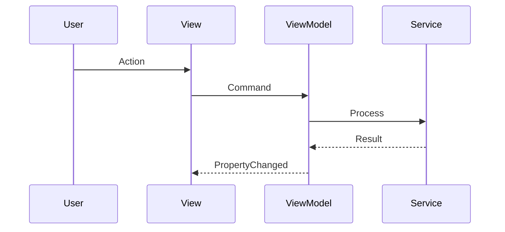

# Documentation Updates

Update wiki documentation after code changes. Handles user docs (requires review) and developer docs (Claude-authored).

## Usage

```
/documentation --dev-docs          # Developer documentation only
/documentation --user-docs         # User documentation only (staged for review)
/documentation                     # Both types
```

## Scope

### User Documentation
- Getting started guides
- Feature explanations
- Screenshots and tutorials
- **Requires human review before publishing**

### Developer Documentation
- Architecture diagrams (Mermaid)
- Data flows
- Code relationships
- **Claude-authored, clinical and terse**

## Triggers

Developer documentation updates should be checked when:
- Parley code changes
- Manifest code changes
- Quartermaster code changes
- Radoub.Formats changes
- Refactors (change relationships/references)

## Workflow

### Step 1: Identify Changed Areas

```bash
# Get changed files from current branch vs main
git diff main...HEAD --name-only
```

Categorize by tool:
- `Parley/**` → Parley wiki pages
- `Manifest/**` → Manifest wiki pages
- `Quartermaster/**` → Quartermaster wiki pages
- `Radoub.Formats/**` → Radoub-Formats wiki pages

### Step 2: Map Changes to Wiki Pages

| Code Path | Wiki Page |
|-----------|-----------|
| `Parley/Parley/Services/` | Parley-Developer-Architecture |
| `Parley/Parley/ViewModels/` | Parley-Developer-Architecture |
| `Parley/Parley/Views/` | Parley-Developer-Architecture (UI section) |
| `Manifest/Manifest/Services/` | Manifest-Developer-Architecture |
| `Quartermaster/Quartermaster/` | Quartermaster-Developer-Architecture |
| `Radoub.Formats/Radoub.Formats/` | Radoub-Formats |
| Copy/paste logic | Parley-Developer-CopyPaste |
| Delete behavior | Parley-Developer-Delete-Behavior |
| Scrap system | Parley-Developer-Scrap-System |
| Test infrastructure | Parley-Developer-Testing |

### Step 3: Check Freshness Dates

Wiki repo: `d:\LOM\workspace\Radoub.wiki\`

```bash
cd d:\LOM\workspace\Radoub.wiki
# Check freshness dates at bottom of relevant pages
grep -l "Page freshness:" *.md | xargs grep "Page freshness:"
```

**30-day rule**: Pages older than 30 days with related code changes are STALE.

### Step 4: Developer Docs Updates

**Style requirements:**
- Clinical, terse language
- No marketing speak
- Technical accuracy over readability
- Data flows shown with Mermaid diagrams
- Small relationships use arrows: `A → B → C`

**Mermaid diagram standards:**



For complex flows:



**Update process:**

1. Read current wiki page
2. Identify sections affected by code changes
3. Update architecture descriptions
4. Update/add Mermaid diagrams for changed data flows
5. Update freshness date to today
6. Stage changes (don't commit yet for dev docs)

### Step 5: User Docs Updates

**For `--user-docs` flag:**

1. Identify user-facing changes from CHANGELOG
2. List wiki pages that need updates
3. Draft updates in NonPublic folder: `[Tool]/NonPublic/wiki-draft-[page-name].md`
4. Report drafts to user for review

**Do NOT directly update user wiki pages. Stage for review.**

### Step 6: Commit Developer Docs

```bash
cd d:\LOM\workspace\Radoub.wiki
git add .
git status
```

**Ask user before committing:**
> "Ready to commit developer documentation updates. Proceed?"

If confirmed:
```bash
git commit -m "Update developer docs for PR #[number]

Pages updated:
- [page1]
- [page2]

🤖 Generated with [Claude Code](https://claude.com/claude-code)

Co-Authored-By: Claude Opus 4.5 <noreply@anthropic.com>"
git push
```

### Step 7: Generate Summary

```markdown
## Documentation Update Summary

**PR**: #[number]
**Date**: [today]

---

### Developer Documentation

| Page | Status | Changes |
|------|--------|---------|
| [Page-Name] | ✅ Updated | [brief description] |
| [Page-Name] | ⏭️ No changes needed | - |

**Freshness dates updated**: [list pages]

### User Documentation

| Page | Status | Draft Location |
|------|--------|----------------|
| [Page-Name] | 📝 Draft ready | [Tool]/NonPublic/wiki-draft-[name].md |
| [Page-Name] | ⏭️ No changes needed | - |

**Note**: User docs require review before publishing.

---

### Files Updated

Wiki pages:
- `d:\LOM\workspace\Radoub.wiki\[Page-Name].md`

Draft files (if any):
- `[Tool]/NonPublic/wiki-draft-[name].md`
```

## Page Templates

### New Developer Architecture Page

```markdown
# [Tool]-Developer-Architecture

Technical architecture for [Tool].

## Overview

[1-2 sentences describing the tool's purpose]

## Component Structure



## Data Flow

### [Operation Name]



## Key Services

### [ServiceName]

Purpose: [1 sentence]

Dependencies: `ServiceA` → `ServiceB`

## Models

[Brief description of domain models]

---

*Page freshness: YYYY-MM-DD*
```

## Flags

- `--dev-docs`: Developer documentation only (Claude-authored)
- `--user-docs`: User documentation only (staged for review)
- `--dry-run`: Show what would be updated without making changes
- `--verbose`: Show detailed analysis

## Notes

- Always update freshness dates when modifying pages
- Developer docs are pushed directly after user confirmation
- User docs are staged in NonPublic for human review
- Refactors especially need diagram updates (relationships change)
