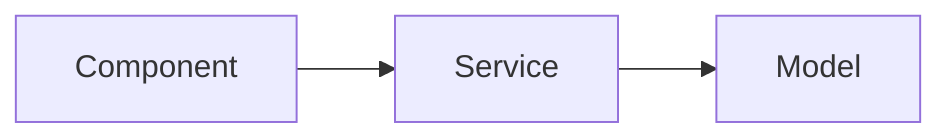
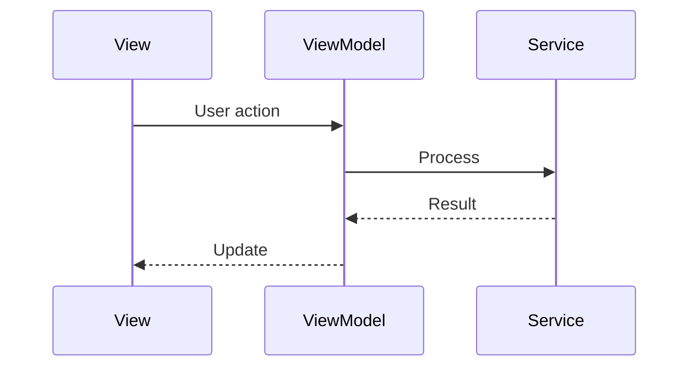
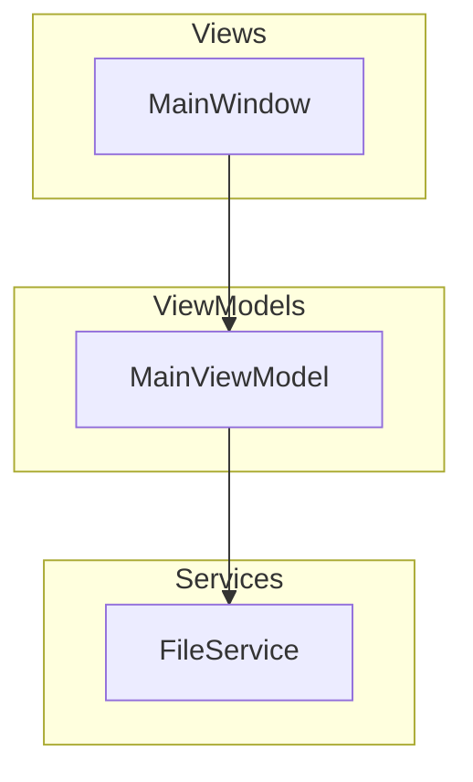
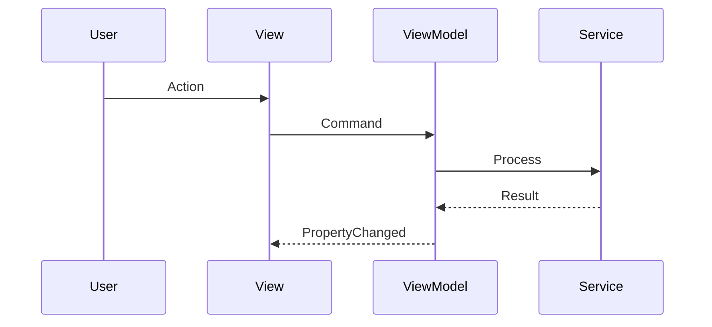

# Documentation Updates

Update wiki documentation after code changes. Developer docs are Claude-authored and
committed; user docs are staged for human review.

## Usage

```
/documentation [--dev-docs | --user-docs] [--dry-run] [--verbose]
```

No flag does both. Ask once, up front: scope (both / dev-only / user-only), whether to
auto-commit and push the developer docs, and whether to stage user docs in NonPublic. Then run
without further prompts unless something errors.

Wiki repo: `d:/LOM/workspace/Radoub.wiki/`

| Doc type | Authored by | Published |
|----------|-------------|-----------|
| Developer — architecture, data flows, code relationships | Claude, clinical and terse | Committed after confirmation |
| User — getting started, feature guides, tutorials | Drafted only | Staged for human review |

Check developer docs whenever tool code, `Radoub.Formats`, or `Radoub.UI` changes. Refactors
especially — they move relationships the diagrams describe.

## Phase 1 — Identify

### 1.1 Changed files

```bash
# Triple-dot (main...HEAD) trips the sandbox path-traversal guard (#2468).
git diff --name-only "$(git merge-base main HEAD)" HEAD
```

### 1.2 Map to wiki pages

| Code path | Wiki page |
|-----------|-----------|
| `Parley/Parley/Services/`, `ViewModels/` | Parley-Developer-Architecture |
| `Parley/Parley/Views/` | Parley-Developer-Architecture (UI section) |
| Copy/paste logic | Parley-Developer-CopyPaste |
| Delete behavior | Parley-Developer-Delete-Behavior |
| Scrap system | Parley-Developer-Scrap-System |
| Test infrastructure | Parley-Developer-Testing |
| `Manifest/Manifest/Services/` | Manifest-Developer-Architecture |
| `Quartermaster/Quartermaster/` | Quartermaster-Developer-Architecture |
| `Relique/Relique/` | Relique-Developer-Architecture |
| `Reliquary/Reliquary/` | Reliquary-Developer-Architecture |
| `Fence/Fence/` | Fence-Developer-Architecture |
| `Trebuchet/Trebuchet/` | Trebuchet-Developer-Architecture |
| `Radoub.Formats/` | Radoub-Formats plus the specific format page |
| `Radoub.UI/` | Radoub-UI-Developer |

### 1.3 Check freshness

```bash
grep -r "Page freshness:" d:/LOM/workspace/Radoub.wiki/*.md
```

A page is stale when it exceeds its threshold **and** related code changed:

| Tool | Threshold |
|------|-----------|
| Parley, Manifest | 60 days |
| Everything else | 30 days |

Parley and Manifest get the longer window because their codebases are winding down — most
changes touching them are Radoub-wide refactors rather than tool work.

## Phase 2 — Update developer docs

Read the page, find the sections the code changed, update the architecture description and
any Mermaid diagram whose relationships moved, then set the freshness date to today. Stage
without committing yet.

Correct anything the change made false. A page describing behavior that no longer exists is
worse than an old date, because it reads as current.

Style: clinical and terse, no marketing, technical accuracy over readability. Small
relationships inline as `A → B → C`; larger ones as diagrams. Run drafted prose through the
concision pass (`elements-of-style:writing-clearly-and-concisely`) — wiki pages are long-lived
and read often, so they repay the tokens. See Commit & PR Standards in CLAUDE.md.


```mermaid
flowchart LR
    A[Component] --> B[Service]
    B --> C[Model]
```


```mermaid
sequenceDiagram
    participant UI as View
    participant VM as ViewModel
    participant S as Service
    UI->>VM: User action
    VM->>S: Process
    S-->>VM: Result
    VM-->>UI: Update
```

## Phase 3 — Draft user docs

Identify user-facing changes from the CHANGELOG, list the pages needing updates, and draft
them at `NonPublic/[Tool]/wiki-draft-[page-name].md`.

**Never edit user wiki pages directly.** Stage the draft and report it; the human reviews and
publishes.

## Phase 4 — Commit and report

Only developer docs, only after confirmation. Use `git -C` rather than `cd` — a `cd` prefix
is blocked by `.claude/hooks/check-cd-prefix.sh`.

```bash
git -C d:/LOM/workspace/Radoub.wiki add .
git -C d:/LOM/workspace/Radoub.wiki commit -m "Update developer docs for PR #[number]

Pages updated:
- [page1]
- [page2]

Co-Authored-By: Claude Opus 4.8 (1M context) <noreply@anthropic.com>"
git -C d:/LOM/workspace/Radoub.wiki push
```

```markdown
## Documentation Update Summary

**PR**: #[number]
**Date**: [today]

### Developer Documentation
| Page | Status | Changes |
|------|--------|---------|
| [Page-Name] | ✅ Updated | [brief description] |
| [Page-Name] | ⏭️ No changes needed | - |

### User Documentation
| Page | Status | Draft |
|------|--------|-------|
| [Page-Name] | 📝 Ready for review | NonPublic/[Tool]/wiki-draft-[name].md |
```

## New developer page template

````markdown
# [Tool]-Developer-Architecture

Technical architecture for [Tool].

## Overview

[1-2 sentences on the tool's purpose]

## Component Structure


```mermaid
flowchart TD
    subgraph Views
        V1[MainWindow]
    end
    subgraph ViewModels
        VM1[MainViewModel]
    end
    subgraph Services
        S1[FileService]
    end
    V1 --> VM1
    VM1 --> S1
```

## Data Flow

### [Operation Name]


```mermaid
sequenceDiagram
    participant U as User
    participant V as View
    participant VM as ViewModel
    participant S as Service
    U->>V: Action
    V->>VM: Command
    VM->>S: Process
    S-->>VM: Result
    VM-->>V: PropertyChanged
```

## Key Services

### [ServiceName]

Purpose: [1 sentence]

Dependencies: `ServiceA` → `ServiceB`

## Models

[Brief description of domain models]

---

*Page freshness: YYYY-MM-DD*
````
