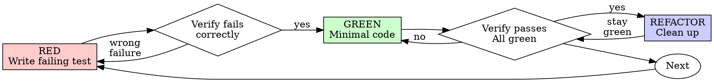

# Test-Driven Development (TDD)

## Overview

Write the test first. Watch it fail. Write minimal code to pass.

**Core principle:** If you didn't watch the test fail, you don't know if it tests the right thing.

**Violating the letter of the rules is violating the spirit of the rules.**

## When to Use

**The authority for this is the TDD Policy table in `CLAUDE.md`.** It is narrower than the
generic "always" and it wins. Reproduced here:

| Scenario | TDD Required? |
|----------|--------------|
| New feature / service / parser | **Yes** |
| New shared library or cross-tool code (`Radoub.Formats`, `Radoub.UI`) | **Yes** |
| Bug fix (reproducible) | **Yes** — failing test reproducing the bug first |
| Bug fix (investigation needed) | No — debug first, add regression test after |
| UI layout / styling / AXAML only | No — manual verification |
| Config / documentation only | No |

The **No** rows are real exemptions, not rationalizations — do not talk yourself back into
TDD for an AXAML-only change. Everything else in this skill applies to the **Yes** rows.

Thinking "skip TDD just this once" on a **Yes** row? Stop. That's rationalization.

Note the split: "investigation needed" means you genuinely cannot reproduce it yet. Once you
*can* reproduce it, it is a reproducible bug fix — write the failing test.

## The Iron Law

```
NO PRODUCTION CODE WITHOUT A FAILING TEST FIRST
```

Write code before the test? Delete it. Start over.

**No exceptions:**
- Don't keep it as "reference"
- Don't "adapt" it while writing tests
- Don't look at it
- Delete means delete

Implement fresh from tests. Period.

## Red-Green-Refactor



### RED - Write Failing Test

Write one minimal test showing what should happen.

<Good>
```csharp
[Fact]
public void ReadLocalizedString_TruncatesOverlongEntry_InsteadOfThrowing()
{
    var gff = GffTestData.WithLocalizedString(length: 70_000);

    var result = GffReader.ReadLocalizedString(gff);

    Assert.Equal(65_535, result.Length);
}
```
Clear name, tests real behavior, one thing
</Good>

<Bad>
```csharp
[Fact]
public void ReaderWorks()
{
    var mock = new Mock<IGffReader>();
    mock.Setup(r => r.ReadLocalizedString(It.IsAny<GffStruct>())).Returns("ok");

    var result = mock.Object.ReadLocalizedString(null);

    Assert.Equal("ok", result);
}
```
Vague name, tests the mock not the code
</Bad>

**Requirements:**
- One behavior
- Clear name
- Real code (no mocks unless unavoidable)

### Verify RED - Watch It Fail

**MANDATORY. Never skip.**

```bash
dotnet test Radoub.Formats/Radoub.Formats.Tests --filter "FullyQualifiedName~ReadLocalizedString"
```

Run the targeted test project, not `Radoub.sln` — the full suite takes ~30 minutes. See
`verification-before-completion` for how to capture output without discarding failures.

Confirm:
- Test fails (not errors)
- Failure message is expected
- Fails because feature missing (not typos or a missing `using`)

**Test passes?** You're testing existing behavior. Fix test.

**Test errors?** Fix error, re-run until it fails correctly.

### GREEN - Minimal Code

Write simplest code to pass the test.

<Good>
```csharp
public static string ReadLocalizedString(GffStruct gff)
{
    var raw = gff.GetString(Field.LocalizedString);
    return raw.Length > MaxLength ? raw[..MaxLength] : raw;
}
```
Just enough to pass
</Good>

<Bad>
```csharp
public static string ReadLocalizedString(
    GffStruct gff,
    int? maxLength = null,
    TruncationMode mode = TruncationMode.Tail,
    Action<string>? onTruncated = null,
    bool preserveWordBoundaries = false)
{
    // YAGNI — none of this is required by the test
}
```
Over-engineered
</Bad>

Don't add features, refactor other code, or "improve" beyond the test.

### Verify GREEN - Watch It Pass

**MANDATORY.**

```bash
dotnet test Radoub.Formats/Radoub.Formats.Tests
```

Confirm:
- Test passes
- Other tests in the affected project still pass
- Output pristine (no new build warnings)

Changed a shared library? `Radoub.Formats` and `Radoub.UI` are consumed by every tool — also
test the tools that use the code you touched.

**Test fails?** Fix code, not test.

**Other tests fail?** Fix now.

### REFACTOR - Clean Up

After green only:
- Remove duplication
- Improve names
- Extract helpers

Keep tests green. Don't add behavior.

### Repeat

Next failing test for next feature.

## Good Tests

| Quality | Good | Bad |
|---------|------|-----|
| **Minimal** | One thing. "and" in name? Split it. | `test('validates email and domain and whitespace')` |
| **Clear** | Name describes behavior | `test('test1')` |
| **Shows intent** | Demonstrates desired API | Obscures what code should do |

## Why Order Matters

**"I'll write tests after to verify it works"**

Tests written after code pass immediately. Passing immediately proves nothing:
- Might test wrong thing
- Might test implementation, not behavior
- Might miss edge cases you forgot
- You never saw it catch the bug

Test-first forces you to see the test fail, proving it actually tests something.

**"I already manually tested all the edge cases"**

Manual testing is ad-hoc. You think you tested everything but:
- No record of what you tested
- Can't re-run when code changes
- Easy to forget cases under pressure
- "It worked when I tried it" ≠ comprehensive

Automated tests are systematic. They run the same way every time.

**"Deleting X hours of work is wasteful"**

Sunk cost fallacy. The time is already gone. Your choice now:
- Delete and rewrite with TDD (X more hours, high confidence)
- Keep it and add tests after (30 min, low confidence, likely bugs)

The "waste" is keeping code you can't trust. Working code without real tests is technical debt.

**"TDD is dogmatic, being pragmatic means adapting"**

TDD IS pragmatic:
- Finds bugs before commit (faster than debugging after)
- Prevents regressions (tests catch breaks immediately)
- Documents behavior (tests show how to use code)
- Enables refactoring (change freely, tests catch breaks)

"Pragmatic" shortcuts = debugging in production = slower.

**"Tests after achieve the same goals - it's spirit not ritual"**

No. Tests-after answer "What does this do?" Tests-first answer "What should this do?"

Tests-after are biased by your implementation. You test what you built, not what's required. You verify remembered edge cases, not discovered ones.

Tests-first force edge case discovery before implementing. Tests-after verify you remembered everything (you didn't).

30 minutes of tests after ≠ TDD. You get coverage, lose proof tests work.

## Common Rationalizations

| Excuse | Reality |
|--------|---------|
| "Too simple to test" | Simple code breaks. Test takes 30 seconds. |
| "I'll test after" | Tests passing immediately prove nothing. |
| "Tests after achieve same goals" | Tests-after = "what does this do?" Tests-first = "what should this do?" |
| "Already manually tested" | Ad-hoc ≠ systematic. No record, can't re-run. |
| "Deleting X hours is wasteful" | Sunk cost fallacy. Keeping unverified code is technical debt. |
| "Keep as reference, write tests first" | You'll adapt it. That's testing after. Delete means delete. |
| "Need to explore first" | Fine. Throw away exploration, start with TDD. |
| "Test hard = design unclear" | Listen to test. Hard to test = hard to use. |
| "TDD will slow me down" | TDD faster than debugging. Pragmatic = test-first. |
| "Manual test faster" | Manual doesn't prove edge cases. You'll re-test every change. |
| "Existing code has no tests" | You're improving it. Add tests for existing code. |

## Red Flags - STOP and Start Over

- Code before test
- Test after implementation
- Test passes immediately
- Can't explain why test failed
- Tests added "later"
- Rationalizing "just this once"
- "I already manually tested it"
- "Tests after achieve the same purpose"
- "It's about spirit not ritual"
- "Keep as reference" or "adapt existing code"
- "Already spent X hours, deleting is wasteful"
- "TDD is dogmatic, I'm being pragmatic"
- "This is different because..."

**All of these mean: Delete code. Start over with TDD.**

## Example: Bug Fix

**Bug:** A blueprint saves with a 20-character resref. The tool accepts it, but Aurora
silently cannot load the file in-game.

**RED**
```csharp
[Fact]
public void Validate_ResrefOver16Chars_ReturnsError()
{
    var result = ResrefValidator.Validate("my_very_long_blueprint");

    Assert.False(result.IsValid);
    Assert.Contains("16 characters", result.Error);
}
```

**Verify RED**
```bash
$ dotnet test Relique/Relique.Tests --filter "FullyQualifiedName~ResrefOver16Chars"
Failed!  - Failed: 1, Passed: 0
  Assert.False() Failure: Expected False, actual True
```

Failing for the right reason: the validator currently accepts it.

**GREEN**
```csharp
public static ValidationResult Validate(string resref)
{
    if (string.IsNullOrWhiteSpace(resref))
        return ValidationResult.Fail("Resref is required");

    if (resref.Length > 16)
        return ValidationResult.Fail($"Resref must be 16 characters or fewer (got {resref.Length})");

    return ValidationResult.Ok();
}
```

**Verify GREEN**
```bash
$ dotnet test Relique/Relique.Tests
Passed!  - Failed: 0, Passed: 47
```

**REFACTOR**
This constraint is Aurora-wide, not Relique-specific — if a second tool needs it, promote the
validator to `Radoub.Formats` and add tests there.

Note what the test asserts: the *behavior Aurora requires*, not the implementation. It would
still pass if the length check moved elsewhere.

## Verification Checklist

Before marking work complete:

- [ ] Every new function/method has a test
- [ ] Watched each test fail before implementing
- [ ] Each test failed for expected reason (feature missing, not typo)
- [ ] Wrote minimal code to pass each test
- [ ] All tests pass
- [ ] Output pristine (no errors, warnings)
- [ ] Tests use real code (mocks only if unavoidable)
- [ ] Edge cases and errors covered

Can't check all boxes? You skipped TDD. Start over.

## When Stuck

| Problem | Solution |
|---------|----------|
| Don't know how to test | Write wished-for API. Write assertion first. Ask your human partner. |
| Test too complicated | Design too complicated. Simplify interface. |
| Must mock everything | Code too coupled. Use dependency injection. |
| Test setup huge | Extract helpers. Still complex? Simplify design. |

## Debugging Integration

Bug found? Write failing test reproducing it. Follow TDD cycle. Test proves fix and prevents regression.

Never fix bugs without a test.

## Testing Anti-Patterns

When adding mocks or test utilities, read @testing-anti-patterns.md to avoid common pitfalls:
- Testing mock behavior instead of real behavior
- Adding test-only methods to production classes
- Mocking without understanding dependencies

## Final Rule

```
Production code → test exists and failed first
Otherwise → not TDD
```

No exceptions without your human partner's permission.
