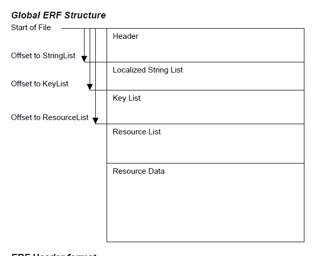

# BioWare Aurora Engine

## Key and BIF File Formats

- [1. Introduction](#1-introduction)
  - [1.1. Conventions](#11-conventions)
  - [1.2. Resource Management](#12-resource-management)
  - [1.3. Resource Types](#13-resource-types)
- [2. Key File Format (KEY)](#2-key-file-format-key)
  - [2.1. Key File Structure](#21-key-file-structure)
  - [2.2. Header](#22-header)
  - [2.3. File Table](#23-file-table)
  - [2.4. Filename Table](#24-filename-table)
  - [2.5. Key Table](#25-key-table)
- [3. BIF File Format (BIF)](#3-bif-file-format-bif)
  - [3.1. BIF File Structure](#31-bif-file-structure)
  - [3.2. Header](#32-header)
  - [3.3. Variable Resource Table](#33-variable-resource-table)
  - [3.4. Fixed Resource Table](#34-fixed-resource-table)
  - [3.5. Resource Data](#35-resource-data)
  - [3.6. Notes](#36-notes)

## 1. Introduction

BioWare's games and tools make use of a very large number of files that are packed into a group of files having the .bif extension. The contents of the .bif files are described by one or more files having the .key extension.

### 1.1. Conventions

This document describes file formats. In all file formats discussed herein, file byte ordering is little endian, which is the format used by Intel processors. If a value is more than 1 byte long, then the least significant byte is the first one, and the most significant byte is the last one.

For example, the number 258 (0x0102 in hex) expressed as a 4-byte integer would be stored as the following sequence of bytes within the file: 0x02, 0x01, 0x00, 0x00.

The following terms are used in this document to refer to integer types:

- **WORD**: 16-bit (2-byte) unsigned integer
- **DWORD**: 32-bit (4-byte) unsigned integer

### 1.2. Resource Management

The game and toolset both use the same resource management system for requesting game resources (ie., files).

Any resource can be obtained simply by specifying a ResRef (filename restricted to 16 characters or less) and ResType (file type). The resource manager handles all the details of getting that resource from whereever it is physically located, which may be in a folder, packed inside a BIF or HAK file, etc. If there is more than one copy of a given file, then one of them overrides all the others, as determined by rules outlined later in this section.

The resource manager has 3 types of source from which it builds its list of resources:

- **keytable**: a .key file, typically located in the same directory as the application itself. A keyfile provides information regarding the contents of a set of .bif files, and each bif file contains files that are used as game resources. (Examples of keytable files: chitin.key, xp1.key, patch.key. Examples of .bif files: any of the .bif files in the data folder). The key and bif formats will be discussed in much greater detail later in this document.

- **directories**: an ordinary directory containing game resource files. (Examples of resource directories: override, modules\temp0)

- **encapsulated file**: an encapsulated resource file (ERF), which contains other files used as game resources. (Examples of encapsulated files: hak paks located in hak folder, erf files located in texturepacks folder). See the ERF Format document for details on the encapsulated resouce file format.

There can be any number of resource sources of each type. If there is more than one resource with the same name and type located in more than one resource source, then the following rules determine which copy of that resource takes priority:

**The last resource source of a given type overrides the first source of that type**.

_Example:_ the toolset adds the override directory to the resource manager on startup, but the module temp directory is created and added to the resource manager only after creating a module. Thus, files the temp directory take precedence over those in the override directory.

**Encapsulated files have the highest priority, then directories, then keytables**, regardless of the order they were added to the resource manager.

_Example_: suppose that the following were added to the resource manager one after another: chitin.key, patch.key, override folder, textures_tpa.erf, modules\temp0 folder, customcontent.hak. The resource manager will place them, in order of lowest to highest priority, as: chitin.key, patch.key, override folder, modules\temp0 folder, textures_tpa.erf, customcontent.hak. If both your module and the customcontent.hak file both contained a script called ns_test00, then the one in the hak file would be used.

### 1.3. Resource Types

All Resources have a Resource Type (ResType) that corresponds to their file type. Resources are stored in BIFs and ERFs without their file extensions, but with their ResTypes instead.

The table below lists ResTypes for resources that may be stored in a BIF or ERF. All ResTypes from 0 to 2999, 9000 to 9999, and 0xFFFF are reserved.

**Table 1.3.1: Resource Types**

| **ResType\*\*\*\*** | **File** **Extension** | **Content Type** | **Description**                                                                                                                                                                                                                                                                   |
| ------------------- | ---------------------- | ---------------- | --------------------------------------------------------------------------------------------------------------------------------------------------------------------------------------------------------------------------------------------------------------------------------- |
| 0xFFFF              | N/A                    | N/A              | Invalid resource type                                                                                                                                                                                                                                                             |
| 1                   | bmp                    | binary           | Windows BMP file                                                                                                                                                                                                                                                                  |
| 3                   | tga                    | binary           | TGA image format                                                                                                                                                                                                                                                                  |
| 4                   | wav                    | binary           | WAV sound file                                                                                                                                                                                                                                                                    |
| 6                   | plt                    | binary           | Bioware Packed Layered Texture, used for player character skins, allows for multiple color layers                                                                                                                                                                                 |
| 7                   | ini                    | text (ini)       | Windows INI file format                                                                                                                                                                                                                                                           |
| 10                  | txt                    | text             | Text file                                                                                                                                                                                                                                                                         |
| 2002                | mdl                    | mdl              | Aurora model                                                                                                                                                                                                                                                                      |
| 2009                | nss                    | text             | NWScript Source                                                                                                                                                                                                                                                                   |
| 2010                | ncs                    | binary           | NWScript Compiled Script                                                                                                                                                                                                                                                          |
| 2012                | are                    | gff              | BioWare Aurora Engine Area file. Contains information on what tiles are located in an area, as well as other static area properties that cannot change via scripting. For each .are file in a .mod, there must also be a corresponding .git and .gic file having the same ResRef. |
| 2013                | set                    | text (ini)       | BioWare Aurora Engine Tileset                                                                                                                                                                                                                                                     |
| 2014                | ifo                    | gff              | Module Info File. See the IFO Format document.                                                                                                                                                                                                                                    |
| 2015                | bic                    | gff              | Character/Creature                                                                                                                                                                                                                                                                |
| 2016                | wok                    | mdl              | Walkmesh                                                                                                                                                                                                                                                                          |
| 2017                | 2da                    | text             | 2-D Array                                                                                                                                                                                                                                                                         |
| 2022                | txi                    | text             | Extra Texture Info                                                                                                                                                                                                                                                                |
| 2023                | git                    | gff              | Game Instance File. Contains information for all object instances in an area, and all area properties that can change via scripting.                                                                                                                                              |
| 2025                | uti                    | gff              | Item Blueprint                                                                                                                                                                                                                                                                    |
| 2027                | utc                    | gff              | Creature Blueprint                                                                                                                                                                                                                                                                |
| 2029                | dlg                    | gff              | Conversation File                                                                                                                                                                                                                                                                 |
| 2030                | itp                    | gff              | Tile/Blueprint Palette File                                                                                                                                                                                                                                                       |
| 2032                | utt                    | gff              | Trigger Blueprint                                                                                                                                                                                                                                                                 |
| 2033                | dds                    | binary           | Compressed texture file                                                                                                                                                                                                                                                           |
| 2035                | uts                    | gff              | Sound Blueprint                                                                                                                                                                                                                                                                   |
| 2036                | ltr                    | binary           | Letter-combo probability info for name generation                                                                                                                                                                                                                                 |
| 2037                | gff                    | gff              | Generic File Format. Used when undesirable to create a new file extension for a resource, but the resource is a GFF. (Examples of GFFs include itp, utc, uti, ifo, are, git)                                                                                                      |
| 2038                | fac                    | gff              | Faction File                                                                                                                                                                                                                                                                      |
| 2040                | ute                    | gff              | Encounter Blueprint                                                                                                                                                                                                                                                               |
| 2042                | utd                    | gff              | Door Blueprint                                                                                                                                                                                                                                                                    |
| 2044                | utp                    | gff              | Placeable Object Blueprint                                                                                                                                                                                                                                                        |
| 2045                | dft                    | text (ini)       | Default Values file. Used by area properties dialog                                                                                                                                                                                                                               |
| 2046                | gic                    | gff              | Game Instance Comments. Comments on instances are not used by the game, only the toolset, so they are stored in a gic instead of in the git with the other instance properties.                                                                                                   |
| 2047                | gui                    | gff              | Graphical User Interface layout used by game                                                                                                                                                                                                                                      |
| 2051                | utm                    | gff              | Store/Merchant Blueprint                                                                                                                                                                                                                                                          |
| 2052                | dwk                    | mdl              | Door walkmesh                                                                                                                                                                                                                                                                     |
| 2053                | pwk                    | mdl              | Placeable Object walkmesh                                                                                                                                                                                                                                                         |
| 2056                | jrl                    | gff              | Journal File                                                                                                                                                                                                                                                                      |
| 2058                | utw                    | gff              | Waypoint Blueprint. See Waypoint GFF document.                                                                                                                                                                                                                                    |
| 2060                | ssf                    | binary           | Sound Set File. See Sound Set File Format document                                                                                                                                                                                                                                |
| 2064                | ndb                    | binary           | Script Debugger File                                                                                                                                                                                                                                                              |
| 2065                | ptm                    | gff              | Plot Manager file/Plot Instance                                                                                                                                                                                                                                                   |
| 2066                | ptt                    | gff              | Plot Wizard Blueprint                                                                                                                                                                                                                                                             |

**Table 1.3.2: Resource Content Types**

| **Content Type** | **Description**                                                                                                                                                                                                                                                                  |
| ---------------- | -------------------------------------------------------------------------------------------------------------------------------------------------------------------------------------------------------------------------------------------------------------------------------- |
| binary           | Binary file format. Details vary widely as to implementation                                                                                                                                                                                                                     |
| text             | Plain text file. For some text resources, it doesn't matter whether lines are terminated by CR+LF or just CR characters, but for other text resources, it might matter. To avoid complications, always use CR+LF line terminators because that at least will work in all cases.. |
| text (ini)       | Windows INI file format. Special case of a text file.                                                                                                                                                                                                                            |
| gff              | BioWare Generic File Format. See the Generic File Format document.                                                                                                                                                                                                               |
| mdl              | BioWare Aurora model file format. Can be plain text or binary.                                                                                                                                                                                                                   |

[↑ Back to Top](#bioware-aurora-engine)

## 2. Key File Format (KEY)

A Key file is an index of all the resources contained within a set of BIF files. The key file contains information as to which BIFs it indexes for and what resources are contained in those BIFs.

### 2.1. Key File Structure

**Figure 2.1: Key File Structure**

### 2.2. Header

**Table 2.2: Keyfile Header**

| **Value**         | **Type** | **Description**                                             |
| ----------------- | -------- | ----------------------------------------------------------- |
| FileType          | 4 char   | "KEY "                                                      |
| FileVersion       | 4 char   | "V1 "                                                       |
| BIFCount          | DWORD    | Number of BIF files that this KEY file controls             |
| KeyCount          | DWORD    | Number of Resources in all BIF files linked to this keyfile |
| OffsetToFileTable | DWORD    | Byte offset of File Table from beginning of this file       |
| OffsetToKeyTable  | DWORD    | Byte offset of Key Entry Table from beginning of this file  |
| Build Year        | DWORD    | Number of years since 1900                                  |
| Build Day         | DWORD    | Number of days since January 1                              |
| Reserved          | 32 bytes | Reserved for future use                                     |

### 2.3. File Table

The File Table is a list of all the BIF files that are associated with the key file.

The number of elements in the File Table is equal to the BIFCount specified in the Header.

Each element in the File Table is a File Entry, and describes a single BIF file.

**Table 2.3: File Entry**

| **Value**      | **Type** | **Description**                                                                                                                                                                                |
| -------------- | -------- | ---------------------------------------------------------------------------------------------------------------------------------------------------------------------------------------------- |
| FileSize       | DWORD    | File size of the BIF.                                                                                                                                                                          |
| FilenameOffset | DWORD    | Byte position of the BIF file's filename in this file. Points to a location in the FileName Table.                                                                                             |
| FilenameSize   | WORD     | Number of characters in the BIF's filename.                                                                                                                                                    |
| Drives         | WORD     | A number that represents which drives the BIF file is located in. Currently each bit represents a drive letter. e.g., bit 0 = HD0, which is the directory where the application was installed. |

### 2.4. Filename Table

The Filename Table lists the filenames of all the BIF files associated with the key file.

Each File Entry in the File Table has a FilenameOffset that indexes into a Filename Entry in the Filename Table.

**Table 2.4: Filename Entry**

| **Value** | **Type** | **Description**                                                                                                                                                                                                                              |
| --------- | -------- | -------------------------------------------------------------------------------------------------------------------------------------------------------------------------------------------------------------------------------------------- |
| Filename  | variable | Filename of the BIF as a non-terminated character string. This filename is relative to the the "drive" where the BIF is located (as specified in the Drives portion of the BIF File Entry). Each Filename must be unique. e.g., data\2da.bif |

### 2.5. Key Table

The Key Table is a list of all the resources in all the BIFs associated with this key file.

The number of elements in the Key Table is equal to the KeyCount specified in the Header.

Each element in the Key Table is a Key Entry, and describes a single resource. A resource may be a Variable Resource, or it may be a Fixed Resource (at this time, all resources are Variable).

**Table 2.5: Key Entry**

| **Value**    | **Type** | **Description**                                                                                                                                                                                                                                                                |
| ------------ | -------- | ------------------------------------------------------------------------------------------------------------------------------------------------------------------------------------------------------------------------------------------------------------------------------ |
| ResRef       | 16 char  | The filename of the resource item without its extension. The game uses this name to access the resource. Each ResRef must be unique.                                                                                                                                           |
| ResourceType | WORD     | Resource Type of the Resource.                                                                                                                                                                                                                                                 |
| ResID        | DWORD    | A unique ID number. It is generated as follows:   Variable: ID = (x << 20) + y   Fixed: ID = (x << 20) + (y << 14)    x = [Index into File Table to specify a BIF]   y = [Index into Variable or Fixed Resource Table in BIF]   (<< means bit shift left) |

[↑ Back to Top](#bioware-aurora-engine)

## 3. BIF File Format (BIF)

A BIF file contains the actual data for game resources. The resources contained in a BIF are described by a KEY file.

### 3.1. BIF File Structure

**Figure 3.1: BIF File Structure**

### 3.2. Header

The BIF file begins with a header that contains file version information and pointers to the various data sections within the file.

**Table 3.2: BIF File Header**

| **Value**             | **Type** | **Description**                                           |
| --------------------- | -------- | --------------------------------------------------------- |
| FileType              | 4 char   | "BIFF"                                                    |
| FileVersion           | 4 char   | "V1 "                                                     |
| VariableResourceCount | DWORD    | Number of variable resources in this BIF                  |
| FixedResourceCount    | DWORD    | Number of fixed resources in this BIF (typically 0)       |
| VariableTableOffset   | DWORD    | Byte offset of Variable Resource Table from start of file |
| FixedTableOffset      | DWORD    | Byte offset of Fixed Resource Table from start of file    |
| Unknown               | 20 bytes | Reserved/padding bytes                                    |

### 3.3. Variable Resource Table

The Variable Resource Table contains entries for all variable resources stored in the BIF file.

**Table 3.3: Variable Resource Entry**

| **Value** | **Type** | **Description**                                                                                                                                                                                                                                                                                                                                                                                                         |
| --------- | -------- | ----------------------------------------------------------------------------------------------------------------------------------------------------------------------------------------------------------------------------------------------------------------------------------------------------------------------------------------------------------------------------------------------------------------------- |
| ID        | DWORD    | A unique ID number. It is generated as follows:  Variable ID = (x << 20) + y  (<< means bit shift left)  y = [Index of this Resource Entry in the BIF] In the BIFs included with the game CDs, x = y.  In the patch BIFs, x = 0.  This discrepancy in x values does not matter to thegame or toolset because their resource manager system doesn't care about the value of x in a BIF. |
| Offset    | DWORD    | Byte offset of resource data from beginning of BIF file. The resource data is the actual contents of the file that this resource represents.                                                                                                                                                                                                                                                                            |
| FileSize  | DWORD    | Number of bytes of resource data. This is the size of the actual file that this resource represents.                                                                                                                                                                                                                                                                                                                    |
| Type      | DWORD    | Resource type. This corresponds to the file extension that the resource would have if it were stored as a separate file.                                                                                                                                                                                                                                                                                                |

### 3.4. Fixed Resource Table

Fixed resources are resources that are always present and have a predetermined location within the BIF file. Currently, all resources are variable resources, so this table is typically empty.

**Table 3.4: Fixed Resource Entry**

| **Value** | **Type** | **Description**                                                                                                                                                                                                                                                                                           |
| --------- | -------- | --------------------------------------------------------------------------------------------------------------------------------------------------------------------------------------------------------------------------------------------------------------------------------------------------------- |
| ID        | DWORD    | A unique ID number. It is generated as follows:  Fixed ID = (x << 20) + (y << 14)  (<< means bit shift left)  x = [Index into File Table to specify a BIF] y = [Index of this Resource Entry in the BIF]  Fixed resources have predetermined locations and are always present. |
| Offset    | DWORD    | Byte offset of resource data from beginning of BIF file. The resource data is the actual contents of the file that this resource represents.                                                                                                                                                              |
| FileSize  | DWORD    | Number of bytes of resource data. This is the size of the actual file that this resource represents.                                                                                                                                                                                                      |
| Type      | DWORD    | Resource type. This corresponds to the file extension that the resource would have if it were stored as a separate file.                                                                                                                                                                                  |

### 3.5. Resource Data

The resource data section contains the actual file data for each resource. Resources are stored in the order they appear in the Variable Resource Table.

Each resource's data begins at the offset specified in its Variable Resource Table entry and continues for the number of bytes specified by the FileSize field.

### 3.6. Notes

BIF files are designed to be efficient for reading game resources. The file structure allows the game engine to quickly locate and load any resource by its ID without having to search through the entire file.

The separation of the index information (stored in KEY files) from the actual data (stored in BIF files) allows for efficient memory usage and faster loading times during gameplay.

[↑ Back to Top](#bioware-aurora-engine)

---

BioWare Corp. http://www.bioware.com
