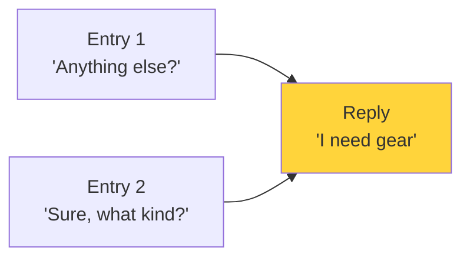
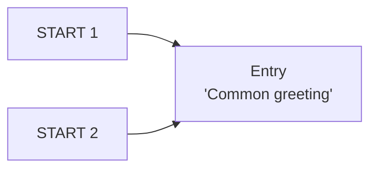

# Delete Operation Behavior in Parley

**Status**: Improved behavior over Aurora Toolset (as of v0.1.0-alpha)

## Overview

Parley uses reference-counting logic to determine when nodes should be deleted. This prevents accidental data loss when multiple conversation paths share the same dialog nodes.

**Key Principle**: A node is only deleted when ALL pointers to it are removed.

## How It Works

### Reference Counting

When you delete a node, Parley:
1. Counts all incoming pointers to child nodes
2. Only deletes children if `otherIncomingLinks == 0`
3. Preserves shared nodes referenced by other conversation paths

### Visual Example

```mermaid
graph TD
    Start1[START: Entry 1<br/>"Hi there"] --> N25[Node 25<br/>"End greeting"]
    Start2[START: Entry 2<br/>"Let's continue"] --> N26[Node 26<br/>"Middle section"]
    Start3[START: Entry 3<br/>"Final thoughts"] --> N51[Node 51<br/>"Conclusion"]

    N25 --> N26
    N26 --> N50[Node 50<br/>"Transition"]
    N50 --> N51

    style Start2 fill:#ff6b6b
    style Start2 stroke:#c92a2a
```

**Before Delete**: 3 conversation starts, nodes 26-50 form middle section, node 51 starts final section

```mermaid
graph TD
    Start1[START: Entry 1<br/>"Hi there"] --> N25[Node 25<br/>"End greeting"]
    Start3[START: Entry 3<br/>"Final thoughts"] --> N51[Node 51<br/>"Conclusion"]

    N25 --> N26[Node 26<br/>"Middle section"]
    N26 --> N50[Node 50<br/>"Transition"]
    N50 --> N51

    style N26 fill:#51cf66
    style N50 fill:#51cf66
    style N51 fill:#51cf66
```

**After Deleting Entry 2 START**: Nodes 26-51 preserved because Entry 1 still references node 26

## Parley vs Aurora

| Scenario | Aurora Behavior | Parley Behavior |
|----------|----------------|-----------------|
| Delete node with shared children | Orphans shared nodes | Preserves shared nodes |
| Delete START with external refs | Breaks pointer chain | Maintains accessibility |
| Shared reply between entries | Can cause corruption | Protected by reference counting |

## Common Scenarios

### Scenario 1: Shared Reply (Original Issue #6)



**Deleting Entry 1**:
- Aurora: Reply disappears, Entry 2 broken
- Parley: Reply preserved (Entry 2 still references it)

### Scenario 2: Linear Chain with No Sharing


**Deleting START or Entry 1**:
- Aurora: Entire chain deleted
- Parley: Entire chain deleted (no external references)

### Scenario 3: Multiple STARTs to Same Node



**Deleting START 1**:
- Aurora: Entry orphaned if START 1 was original
- Parley: Entry preserved (START 2 still references it)

## Technical Details

### DeleteNodeRecursive Logic

From `MainViewModel.cs:1058-1070`:

```csharp
if (otherIncomingLinks == 0)
{
    // No other nodes reference this child, safe to delete recursively
    DeleteNodeRecursive(ptr.Node);
}
else
{
    // This child is shared by other nodes, don't delete it
    UnifiedLogger.LogApplication(LogLevel.DEBUG,
        $"Skipping deletion of shared child (has {otherIncomingLinks} other references)");
}
```

### LinkRegistry System

- Tracks all `DialogPtr` references between nodes
- Provides `GetLinksTo(node)` to count incoming references
- Ensures accurate reference counting during delete operations

## Benefits

1. **Data Safety**: Prevents accidental loss of shared dialog nodes
2. **Predictable**: Consistent behavior regardless of delete order
3. **Aurora Compatible**: Exported files work correctly in NWN
4. **Better UX**: No unexpected disappearances during editing

## Limitations

**Deep Tree Deletion**: Practical limit of ~30 levels for complex shared structures. Professional BioWare dialogs typically stay under 15 levels. See [KNOWN_ISSUES.md](KNOWN_ISSUES.md) for details.

## User Workflow

### When You Want to Delete a Shared Node

1. **Delete all references first**: Remove pointers from all parent nodes
2. **Delete the node last**: Once all incoming pointers removed, node can be deleted
3. **Or use Cut/Paste**: Moving nodes automatically updates references

### Visual Feedback

- TreeView shows all START points
- Shared nodes appear under multiple parents (via link indicators)
- Properties panel shows incoming reference count (future enhancement)

## Orphan Node Handling

**CRITICAL FILE INTEGRITY FEATURE**: When nodes become orphaned (unreachable from any START), Parley moves them to a special container instead of deleting them. This preserves complex dialog subtrees and prevents data loss.

### What Are Orphaned Nodes?

A node is orphaned when:
- It loses its connection to all START points
- But it's still referenced by other nodes (via `IsLink=true` pointers)
- Deleting it would break links in other parts of the dialog

### Orphan Detection Algorithm

**Key Principle**: Traverse from STARTs following ONLY regular pointers (`IsLink=false`)

```csharp
// MainViewModel.cs:CollectReachableNodesForOrphanDetection
private void CollectReachableNodesForOrphanDetection(DialogNode node, HashSet<DialogNode> reachableNodes)
{
    // Only traverse IsLink=false pointers
    // IsLink=true are back-references and should NOT prevent orphaning
    foreach (var pointer in node.Pointers.Where(p => !p.IsLink))
    {
        CollectReachableNodesForOrphanDetection(pointer.Node, reachableNodes);
    }
}
```

**Why this matters**:
- `IsLink=false`: Regular conversation flow (parent → child)
- `IsLink=true`: Back-reference from link child to shared parent
- If we traversed `IsLink=true` pointers, link parents would always appear reachable, preventing proper orphan detection

### Example: Link Parents Becoming Orphaned

```
START 1: "Hey, keep it down..." → "I need gear" (parent)
START 2: "Anything else?" → [grey link] → "I need gear" (IsLink=true back-reference)
                         → "The shady stuff" (parent, has links elsewhere)
```

**Delete START 2**:
- "I need gear" link is removed (just a reference)
- "I need gear" parent stays under START 1 (still reachable)
- "The shady stuff" becomes ORPHANED (no regular path from START)
- BUT "The shady stuff" has `IsLink=true` pointers from other nodes
- SO we preserve it in orphan container (don't delete)

### Orphan Container Structure

```
!!! Orphaned Nodes (Entry, sc_false script)
  ├─ !!! Orphaned NPC Nodes (Reply category)
  │   ├─ [CONTINUE] → Orphaned Entry 1
  │   ├─ [CONTINUE] → Orphaned Entry 2
  │   └─ [CONTINUE] → Orphaned Entry 3
  └─ Orphaned PC Reply 1 (direct children)
```

**ROOT ORPHAN FILTERING** (CRITICAL):
- Only add orphans that are NOT descendants of other orphans
- Prevents duplicate display in tree
- Uses recursive subtree traversal to check

```csharp
// MainViewModel.cs:2897-2908
var rootOrphanedEntries = orphanedEntries.Where(orphan =>
{
    foreach (var otherOrphan in orphanedEntries)
    {
        if (otherOrphan != orphan && IsNodeInSubtree(orphan, otherOrphan))
            return false; // Orphan is descendant of another orphan
    }
    return true; // This is a root orphan
}).ToList();
```

### Bug Pattern: Duplicate Orphans

**Symptom**: Orphaned nodes appear multiple times in container
- Once as direct child
- Again as grandchild/descendant of another orphan

**Root Cause**: Orphan subtrees contain cross-references
- Orphan A → Reply X → Orphan B
- Without filtering, both A and B added to container
- Expanding A shows B again as descendant

**Fix**: `IsNodeInSubtree()` recursively checks if node appears anywhere in another orphan's subtree (MainViewModel.cs:3031-3062)

**Test**: `OrphanNodeTests.cs` should include test for nested orphan structures

### When Orphan Container Appears

- **sc_false script**: Container START has `ScriptAppears="sc_false"`
- **Never in-game**: Requires `sc_false.nss` module script (always returns FALSE)
- **Writer decision**: Move subtrees back to conversation or delete permanently

## Testing

See `Parley.Tests/` for test coverage:
- `DeleteOperationTests.cs`: Reference counting and shared node preservation
- `OrphanNodeTests.cs`: Orphan detection and container creation
  - **MUST include**: Nested orphan subtrees (cross-referencing orphans)
- `OrphanContainerIntegrationTests.cs`: Round-trip file persistence

## Related Documentation

- [DEEP_TREE_LIMITATION.md](DEEP_TREE_LIMITATION.md) - Depth limitation details
- Issue #6 - Original bug report and fix
- Issue #27 - Orphan node handling
- LinkRegistry system - Reference tracking implementation
