# Using Parley

Parley is largely the same as Aurora Toolset's conversation editor, but with improvements to workflow and some reorganization of features.

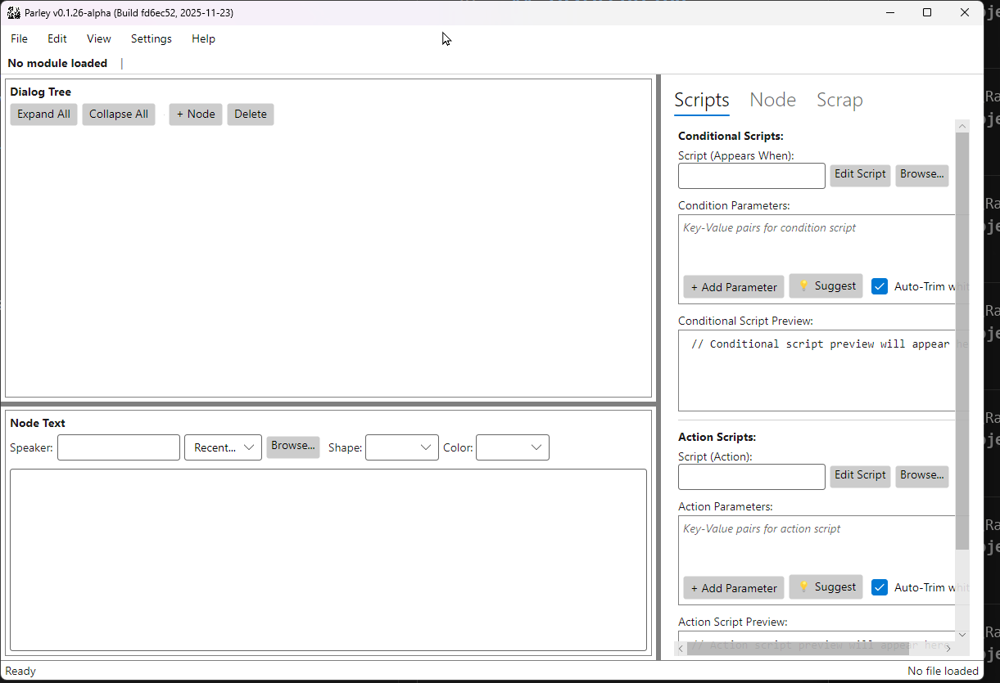

---

## First Launch Setup

When you first launch Parley, configure these settings for the best experience:

### Resource Paths

1. Open **Settings → Preferences** (or press `Ctrl+,`)
2. Go to the **Resource Paths** tab
3. Press Autodetect or Configure:
   - **Module Directory**: Path to your NWN modules folder (recommended)
     - Windows: `~\Documents\Neverwinter Nights\modules`
     - Linux: `~/.local/share/Neverwinter Nights/modules`
     - macOS: `~/Library/Application Support/Neverwinter Nights/modules`
   - **Base Game Installation**: Path to NWN installation (optional, for base game resources)
   - **External Editor**: Path to your preferred script editor (optional)

### TLK Language Settings

For dialogs that reference the base game's Talk Table (TLK) strings, you can select which language to display:

1. In **Settings → Resource Paths**, find **TLK Language Settings**
2. Select your preferred language from the dropdown (English, German, French, Spanish, Italian, Polish)
3. Optionally enable **Use female text variant** for languages with gendered dialog
4. Changing the language will prompt to reload the current dialog
5. Since settings window is modeless, you can change this in real time

*Note: This only affects dialogs that use StrRef values pointing to the TLK file. Dialogs with embedded text are not affected.*

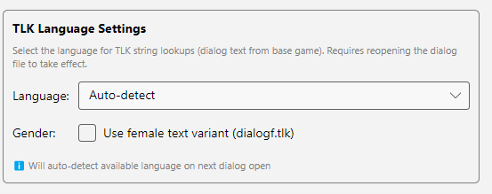

### UI Customization (Optional)

Personalize Parley's appearance in **Settings → Preferences → UI Settings**:

- **Theme**: Choose from Standard, Dark, or accessibility themes
- **Font Size**: Adjust text size for readability
- **Font Family**: Select your preferred font (This overrides the theme settings)
- **Scrollbar Behavior**: Keep scrollbars visible or allow auto-hide
- **NPC Tag Coloring**: Enable/disable color-coded NPCs in multi-NPC conversations

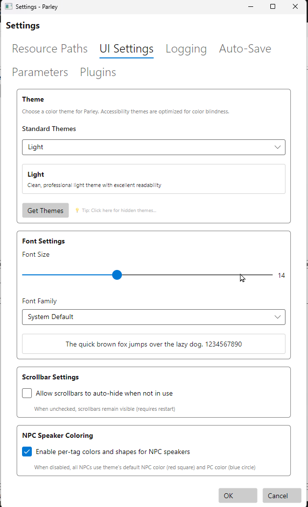

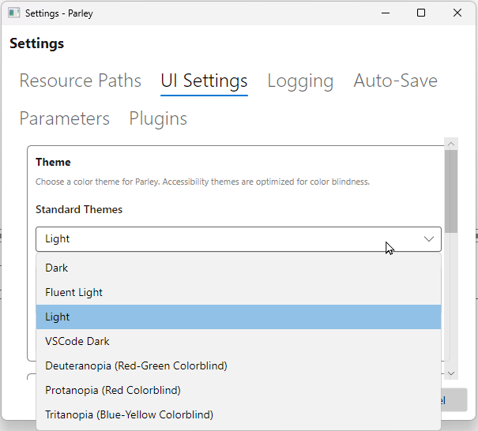

### Auto-Save Configuration

Configure automatic saving in **Settings → Auto-Save**:

- **Enable Auto-Save**: Toggle automatic saving on/off
- **Interval**: Set how frequently Parley auto-saves (in minutes)
- Parley displays the last saved time in the status bar
- If you have an older machine, you may want to slow the frequency of autosaves

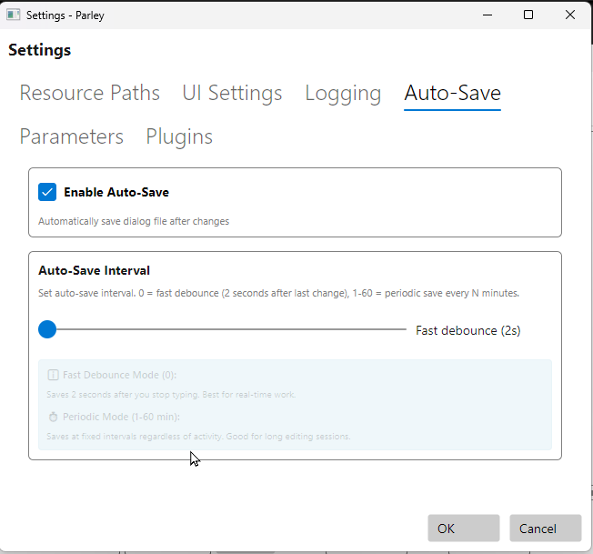

---

## Working with Dialog Files

### Creating or Opening Dialogs

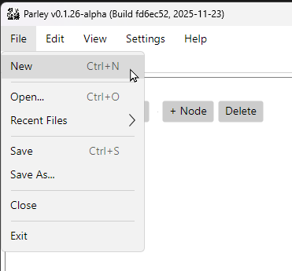

- **File → New** (`Ctrl+N`): Create a new dialog file
  - Choose save location and filename
  - Remember: Aurora Engine limits filenames to 12 characters (excluding `.dlg`)
- **File → Open** (`Ctrl+O`): Browse for an existing `.dlg` file
- **Recent Files**: Quick access to recently opened files

### Saving Your Work

- **File → Save** (`Ctrl+S`): Save current dialog
- **File → Save As** (`Ctrl+Shift+S`): Save with a new name/location
- **Auto-Save**: Configured in Settings (see above)
- **Status Bar**: Shows last saved time

---

## Editing Dialogs

### Tree View Navigation

The tree view shows your conversation structure:

- **Click** a node to select and view properties
- **Double-click** to expand/collapse child nodes
 - Or Right click and Expand This Node and Sub Nodes
- **Right-click** for context menu:
  - Add Entry/Reply nodes
  - Delete selected node
  - Cut/Paste nodes

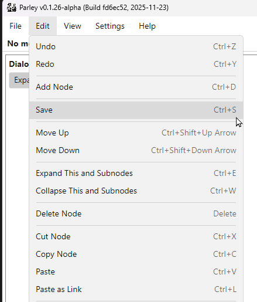

### Adding Nodes

- **Add Entry Node**: NPC dialog line
- **Add PC Reply**: Player character response
- **Smart Add Child Node** (`Ctrl+D`): Automatically adds appropriate node type based on parent
- **Smart Add Sibling Node** (`Ctrl+Shift+D`):Add another node adjacent to a existing child node

### Reordering Nodes

- **Move Up/Down**: `Ctrl+Shift+Up` / `Ctrl+Shift+Down`
- **Drag and Drop**: (In progress) Reorder siblings by dragging

### Undo/Redo

- **Undo**: `Ctrl+Z`
- **Redo**: `Ctrl+Y`

---

## Properties Panel

The Properties Panel displays details for the selected node. It has multiple tabs:

### Node Tab

Configure basic node properties:

- **Comment**: Internal notes (not shown in-game)
- **Quest/Journal**: Link to journal entries
- **Sound**: Assign voiceover audio files

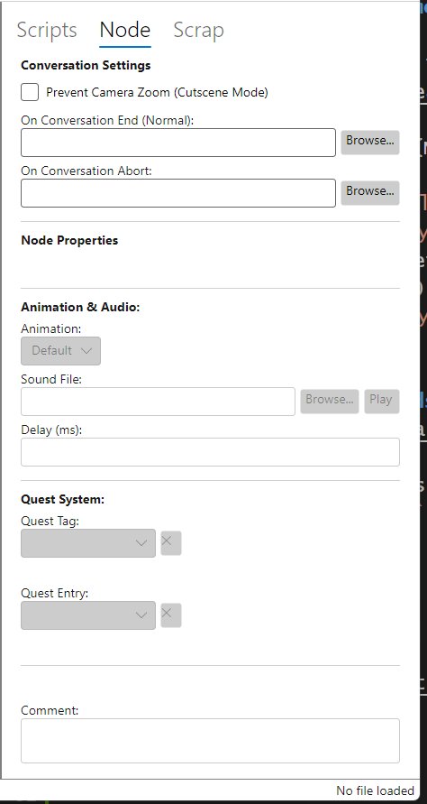

**Sound Browser**:

Click the Browse button next to the Sound field to open the Sound Browser:

- Browse sound files from multiple sources:
  - HAK files
  - Base game resources (In progress)
- Filter sounds by name using the search box
- Preview audio before assigning (play button)
- Double-click or press Select to assign sound to the node

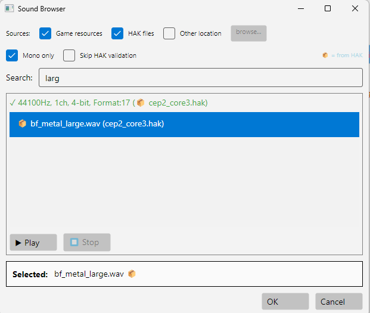

### Scripts Tab

Manage scripts and parameters:

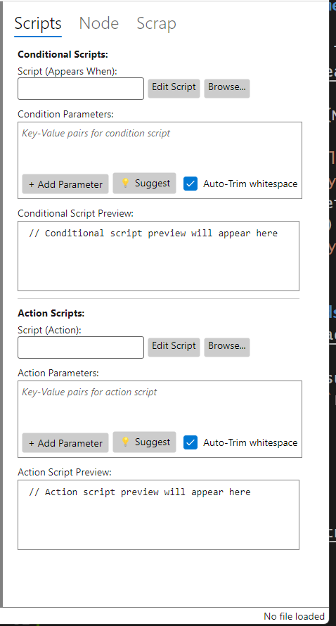

**Conditional Scripts** (Appears When):

- **Script Name**: NWScript that determines if node appears
- **Parameters**: Script parameters with auto-trim
- **Browse Button**: Search module scripts with preview
- **Suggest Button**: Suggested parameters based on caching
- **Edit Script Button**: Open script in external editor (configured in Settings)

**Action Scripts**:
- Same features as Conditional Scripts

**Script Parameter System**:

- Parameter browser shows available parameters from script declarations
- Auto-trim removes whitespace automatically
- Helps avoid typos and parameter errors
- See [advanced script parameter](Parley\Documentation\User\Script_Parameter_Browser.md) browser options

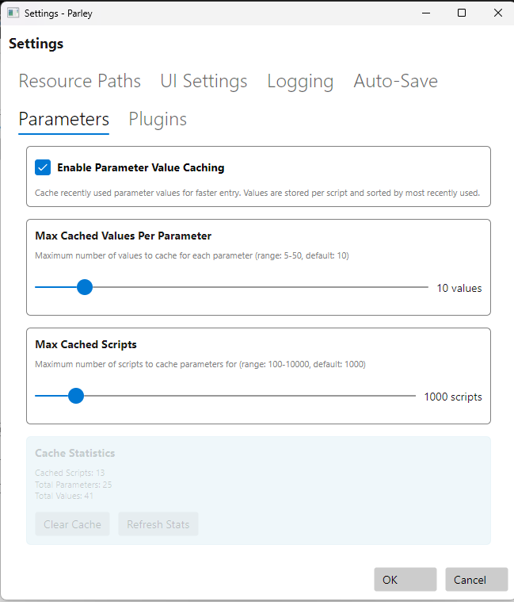

### Node Text Panel

Quick access to frequently edited properties:

- **Text**: Edit dialog text
- **Speaker Tag**: Set NPC speaker
- **Speaker Visuals**: Customize NPC colors and shapes (per-tag preferences)
  - PC (Player): Blue circle (fixed)
  - Owner (default NPC): Orange square (fixed)
  - Named NPCs: Customizable colors and shapes
  - Preferences persist across sessions
  - Theme aware

### Scrap Panel (In Progress)

The Scrap panel holds deleted nodes:

- **Different from Aurora**: Scrap persists between sessions
- **Restore**: Individual lines can be recovered from scrap
- **Clear**: Empty scrap with clear button
- Prevents accidental loss of dialog content

---

## Conversation-Wide Settings

Select the **ROOT** node to access conversation-level properties:

- **Prevent Camera Zoom**: Camera settings
- **On Conversation End**: Auto-close behavior
- **On Conversation Abort**: Auto-close behavior

---

## Color-Coded NPCs

Parley automatically color-codes speakers in multi-NPC conversations giving a simple visual of which character is speaking.

- **PC Replies**: Blue circle
- **Owner (default)**: Orange square
- **Named NPCs**: Initial hash-assigned colors and shapes (consistent within sessions)
- **Custom Preferences**: Set per-tag colors/shapes in Node Text Panel

This feature can be disabled in **Settings → UI Settings → NPC Speaker Coloring**.

*Note: In the images below Becky and BECKY are used, this is to demonstrate that this is case sensitive.*

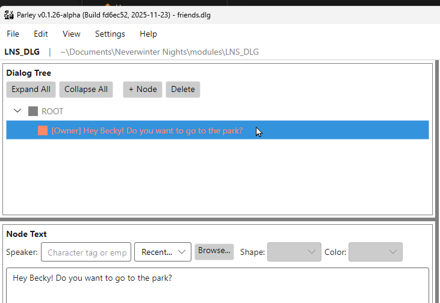
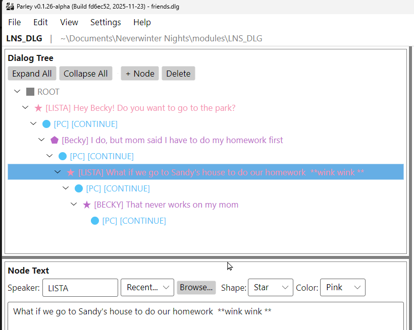
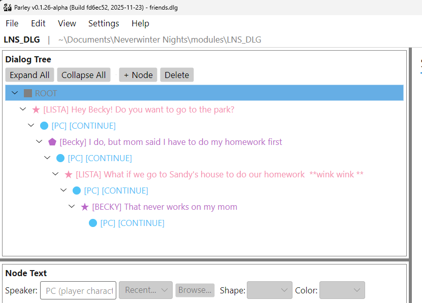
---

## Keyboard Shortcuts

### File Operations

- `Ctrl+N`: New dialog
- `Ctrl+O`: Open file
- `Ctrl+S`: Save
- `Ctrl+Shift+S`: Save As

### Editing

- `Ctrl+Z`: Undo
- `Ctrl+Y`: Redo
- `Ctrl+X`: Cut node
- `Ctrl+D`: Create child node (smart add)
- `Ctrl+Shift+Up/Down`: Move node up/down

---

## Settings Reference

### Settings Menu

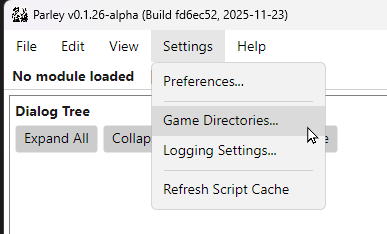

Access all configuration options via **Settings → Preferences** (`Ctrl+,`).

### Resource Paths

Configure game and module directories for resource browsers.

### UI Settings

Customize appearance: themes, fonts, scrollbars, NPC coloring.

### Themes

Choose visual themes including accessibility options.

### Logging

Configure log levels and debug output for troubleshooting.

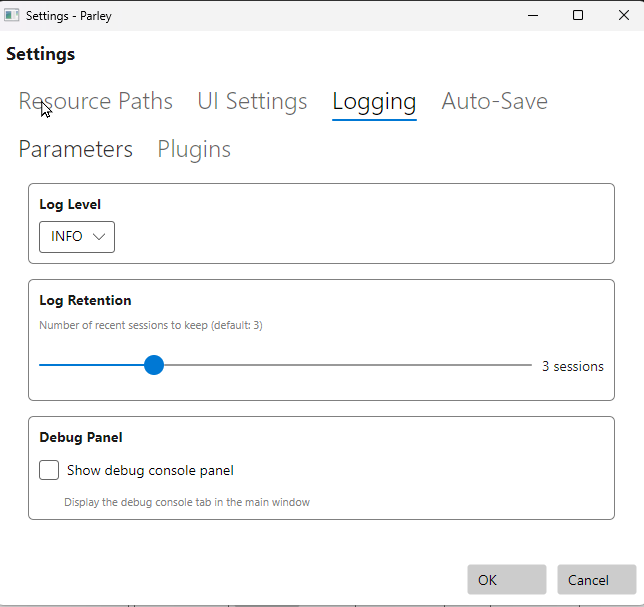

### Auto-Save

Enable and configure automatic saving intervals.

### Parameters

Configure script parameter caching and validation.

### Plugins (In Progress)

Manage Python-based plugins for extended functionality.

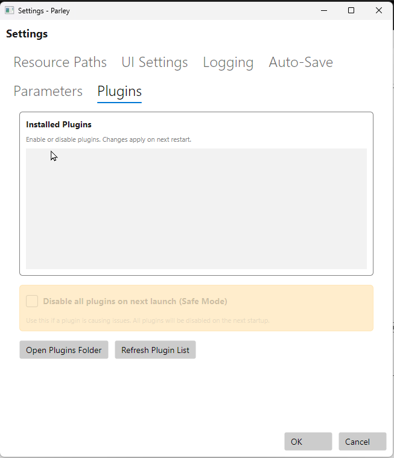

---

## Troubleshooting and Support

### Reporting Issues

If you report problems with Parley, you may be asked for logs:

1. **Enable Debug Logging**:

   - Go to **Settings → Logging**
   - Set log level to **DEBUG**
   - Reproduce the issue

   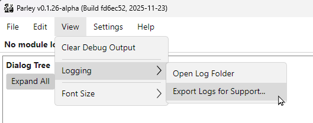

2. **Report on GitHub**:
   - Visit [GitHub Issues](https://github.com/LordOfMyatar/Radoub/issues)
   - Include reproduction steps & Screen shots

### Known Limitations

- **Filename Length**: Aurora Engine requires ≤12 character filenames (excluding `.dlg`)
- **Drag and Drop**: Reordering siblings via drag-drop is in progress

---

## Additional Resources

- [GitHub Repository](https://github.com/LordOfMyatar/Radoub)
- [Issue Tracker](https://github.com/LordOfMyatar/Radoub/issues?q=is%3Aissue+label%3Aparley)
- [Project Roadmap](https://github.com/users/LordOfMyatar/projects/2)
